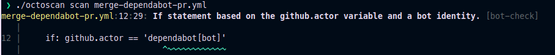
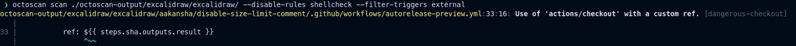
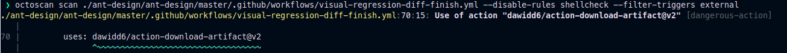
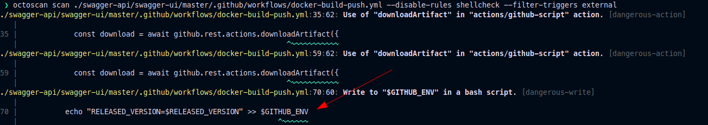
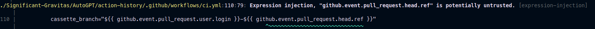
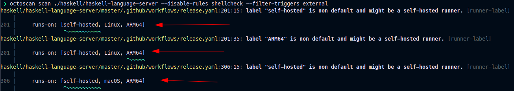
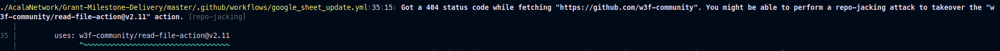
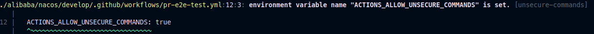
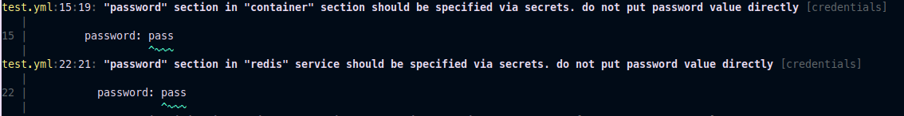

<div align="center">
	:octocat:
	<h1>octoscan</h1>
	<p>Octoscan is a static vulnerability scanner for GitHub action workflows.</p>
	<br>
	
	<br>
	<a href="https://securityscorecards.dev/viewer/?uri=github.com/synacktiv/octoscan"></a>
</div>

## Table of Contents

- [Table of Contents](#table-of-contents)
- [Installation](#installation)
- [Usage](#usage)
	- [download remote workflows](#download-remote-workflows)
	- [analyze](#analyze)
	- [GitHub action](#github-action)
- [Rules](#rules)
	- [dangerous-checkout](#dangerous-checkout)
	- [dangerous-action](#dangerous-action)
	- [dangerous-write](#dangerous-write)
	- [expression-injection](#expression-injection)
	- [runner-label](#runner-label)
	- [repo-jacking](#repo-jacking)
	- [unsecure-commands](#unsecure-commands)
	- [bot-check](#bot-check)
	- [known-vulnerability](#known-vulnerability)
	- [credentials](#credentials)
	- [shellcheck](#shellcheck)
	- [local-action](#local-action)
	- [oidc-action](#oidc-action)
- [Credits](#credits)
- [Resources](#resources)

## Installation

```
$ go mod tidy
$ go build
```

Or with docker:

```
$ docker pull ghcr.io/synacktiv/octoscan:latest
```

## Usage

### download remote workflows

Octoscan can be run against a local git repository or you can download all the workflows with the `dl` action:
```sh
$ octoscan dl -h  
Octoscan.

Usage:
	octoscan dl [options] --org <org> [--repo <repo> --token <pat> --default-branch --max-branches <num> --path <path> --output-dir <dir> --include-archives]

Options:
	-h, --help  						Show help
	-d, --debug  						Debug output
	--verbose  						Verbose output
	--org <org>  						Organizations to target
	--repo <repo>  						Repository to target
	--token <pat>  						GHP to authenticate to GitHub
	--default-branch  					Only download workflows from the default branch
	--max-branches <num>  					Limit the number of branches to download
	--path <path>  						GitHub file path to download [default: .github/workflows]
	--output-dir <dir>  					Output dir where to download files [default: octoscan-output]
	--include-archives  					Also download archived repositories
```

```sh
./octoscan dl --token ghp_<token> --org apache --repo incubator-answer
```

### analyze

If you don't know what to run just run this:
```sh
./octoscan scan path/to/repos/ --disable-rules shellcheck,local-action --filter-triggers external
```

It will reduce false positives and give the most interesting results.

If you have downloaded the workflows with the [dl](#download-remote-workflows) command you might have duplicated workflows since by default octoscan will download all the workflows of all the branches. To delete duplicated workflows and speed up the analysis you can use the `fdupes` command before running the analysis:

```sh
fdupes -n -r -N -d path/to/repo
```


```sh
$ octoscan scan -h
octoscan

Usage:
	octoscan scan [options] --list-rules
	octoscan scan [options] <target>
	octoscan scan [options] <target> [--debug-rules --filter-triggers=<triggers> --filter-run --ignore=<pattern> ((--disable-rules | --enable-rules ) <rules>) --config-file <config>]

Options:
	-h, --help
	-v, --version
	-d, --debug
	--verbose
	--format <format>  				Output format, json, sarif or custom template to format error messages in Go template syntax. See https://github.com/rhysd/actionlint/tree/main/docs/usage.md#format
	--oneline 					Use one line per one error. Useful for reading error messages from programs

Args:
	<target>					Target File or directory to scan
	--filter-triggers <triggers>			Scan workflows with specific triggers (comma separated list: "push,pull_request_target" or pre-configured: external/allnopr)
	--filter-run					Search for expression injection only in run shell scripts.
	--ignore <pattern>				Regular expression matching to error messages you want to ignore.
	--disable-rules <rules>				Disable specific rules. Split on ","
	--enable-rules <rules>				Enable specific rules, this will disable all other rules. Split on ","
	--debug-rules					Enable debug rules.
	--config-file <config>				Config file.

Examples:
	$ octoscan scan ci.yml --disable-rules shellcheck,local-action --filter-triggers external
```

### GitHub action

This tool can also be used directly as a GitHub action to scan your repository on `push`/`pull_request` events. For more information please check [this repository](https://github.com/synacktiv/action-octoscan).

<div align="center">
  
</div>

## Rules

The complete list of rules can be found with this command:
```
$ octoscan scan --list-rules  
2024/08/07 16:50:48 [INFO] Available rules
- dangerous-action
	Check for dangerous actions.
- dangerous-checkout
	Check for dangerous checkout.
- expression-injection
	Check for expression injection.
- dangerous-write
	Check for dangerous write operation on $GITHUB_OUTPUT or $GITHUB_ENV.
- local-action
	Check for local actions.
- oidc-action
	Check for OIDC actions.
- runner-label
	Checks for GitHub-hosted and preset self-hosted runner labels in "runs-on:"
- unsecure-commands
	Check 'ACTIONS_ALLOW_UNSECURE_COMMANDS' env variable.
- known-vulnerability
	Check for known vulnerabilities.
- bot-check
	Check for if statements that are based on a bot identity.
- debug-external-trigger
	Check for workflow that can be externally triggered.
- debug-artefacts
	Check for workflow that upload artefacts.
- debug-js-exec
	Check for workflow that execute system commands in JS scripts.
- repo-jacking
	Verify that external actions are pointing to a valid GitHub user or organization.
```

### dangerous-checkout

Triggers like `workflow_run` or `pull_request_target` run in a privileged context, as they have read access to secrets and potentially have write access on the targeted repository. Performing an explicit checkout on the untrusted code will result in the attacker code being downloaded in such context.



#### examples

- [FreeRDP](https://github.com/FreeRDP/FreeRDP/pull/10209)
- [Excalidraw](https://www.synacktiv.com/publications/github-actions-exploitation-untrusted-input)
- [AutoGPT](https://www.synacktiv.com/publications/github-actions-exploitation-untrusted-input)
- [Cypress](https://www.synacktiv.com/publications/github-actions-exploitation-untrusted-input)
- [Apache Doris](https://www.synacktiv.com/publications/github-actions-exploitation-untrusted-input)
- [Angular](https://github.com/angular/angular/blob/6b20561e1d6810e867c0ee7692d9fae64426a876/.github/workflows/ci-privileged.yml#L4)

### dangerous-action

This rules warn the user if a dangerous action is used. It's mainly focused on untrusted artifacts.

It is common practice to use artifacts to pass data between different workflows. We often encounter this with the `workflow_run` trigger where the triggering workflow will prepare some data that will then be sent to the triggered workflow. Given the untrusted nature of this artifact data, it is crucial to treat it with caution and recognize it as a potential threat. The vulnerability arises from the fact that external entities, such as malicious actors, can influence the content of the artifact data.




#### examples

- [ant-design](https://www.synacktiv.com/publications/github-actions-exploitation-untrusted-input)
- [Swagger-editor](https://www.synacktiv.com/publications/github-actions-exploitation-repo-jacking-and-environment-manipulation)
- [Firebase](https://www.synacktiv.com/publications/github-actions-exploitation-repo-jacking-and-environment-manipulation)
- [Firebase](https://www.legitsecurity.com/blog/github-privilege-escalation-vulnerability-0)
- [Rust](https://www.legitsecurity.com/blog/artifact-poisoning-vulnerability-discovered-in-rust)

### dangerous-write

GitHub will create default environment variables that can be used inside every step in a workflow. The `GITHUB_ENV` and `GITHUB_OUTPUT` variables are particularly interesting. It is possible to define environment variable in a step and to use this variable in another one. This can be done by writing it to the associated variable variable. If a user can control the content of the variable that is being set it can lead to arbitrary code execution.



#### examples

- [Swagger-editor](https://www.synacktiv.com/publications/github-actions-exploitation-repo-jacking-and-environment-manipulation)
- [dgraph-io/badger](https://github.com/dgraph-io/badger/blob/6acc8e801739f6702b8d95f462b8d450b9a0455b/.github/workflows/ci-badger-tests-coverage.yml#L13)
- [Firebase](https://www.legitsecurity.com/blog/github-privilege-escalation-vulnerability-0)
- [microsoft/vscode-github-triage-actions](https://bugs.chromium.org/p/project-zero/issues/detail?id=2070)

### expression-injection

Each workflow trigger comes with an associated GitHub context, offering comprehensive information about the event that initiated it. This includes details about the user who triggered the event, the branch name, and other relevant contextual information. Certain components of this event data, such as the base repository name, or pull request number, cannot be manipulated or exploited for injection by the user who initiated the event (e.g., in the case of a pull request). This ensures a level of control and security over the information provided by the GitHub context during workflow execution.

However, some elements can be controlled by an attacker and should be sanitized before being used. Here is the list of such elements:
- `github.event.issue.title`
- `github.event.issue.body`
- `github.event.pull_request.title`
- `github.event.pull_request.body`
- `github.event.comment.body`
- `github.event.review.body`
- `github.event.pages.*.page_name`
- `github.event.commits.*.message`
- `github.event.head_commit.message`
- `github.event.head_commit.author.email`
- `github.event.head_commit.author.name`
- `github.event.commits.*.author.email`
- `github.event.commits.*.author.name`
- `github.event.pull_request.head.ref`
- `github.event.pull_request.head.label`
- `github.event.pull_request.head.repo.default_branch`
- `github.head_ref`
- `env.*`
- `steps.*.outputs.*`
- `needs.*.outputs.*`



#### examples

- [AutoGPT](https://www.synacktiv.com/publications/github-actions-exploitation-untrusted-input)
- [microsoft/generative-ai-for-beginners](https://www.synacktiv.com/publications/github-actions-exploitation-untrusted-input)

### runner-label

GitHub offers the possibility to host your own runners and customize the environment used to run jobs in workflows. These runners are called self-hosted.

There exists two types of self-hosted runners, ephemeral and non-ephemeral ones. By default, the runners are non-ephemeral, meaning the environment used by the runner is not cleaned after a job completes. If attackers manages to execute code on a non-ephemeral runner, they could backdoor it by adding a process in the background and steal sensitive secrets. These kinds of runners are thus really sensitive.



Non-ephemeral runners can be identified by looking at run logs. A tool called [gato](https://github.com/praetorian-inc/gato) can be used to automate this process.

#### examples

- [Haskell](https://www.synacktiv.com/publications/github-actions-exploitation-self-hosted-runners)
- [lovell/Sharp](https://www.synacktiv.com/publications/github-actions-exploitation-self-hosted-runners)
- [WasmEdge](https://www.synacktiv.com/publications/github-actions-exploitation-self-hosted-runner)
- [Scroll](https://www.synacktiv.com/publications/github-actions-exploitation-self-hosted-runners)
- [Akash Network](https://www.synacktiv.com/publications/github-actions-exploitation-self-hosted-runners)
- [actions/runner-images](https://adnanthekhan.com/2023/12/20/one-supply-chain-attack-to-rule-them-all)
- [tensorflow](https://www.praetorian.com/blog/tensorflow-supply-chain-compromise-via-self-hosted-runner-attack/)
- [pytorch](https://johnstawinski.com/2024/01/11/playing-with-fire-how-we-executed-a-critical-supply-chain-attack-on-pytorch/)


### repo-jacking

The repo jacking vulnerability was [presented](https://media.defcon.org/DEF%20CON%2031/DEF%20CON%2031%20presentations/Asi%20Greenholts%20-%20The%20GitHub%20Actions%20Worm%20Compromising%20GitHub%20repositories%20through%20the%20Actions%20dependency%20tree.pdf) at DEFCON 31 by Asi Greenholts. This vulnerability occurs when a GitHub action is referencing an action on a non-existing GitHub organization or user.



Note that this rule needs internet to check whether the attack is possible or not. All other checks are performed offline.

#### examples

- [Azure/bicep-registry-modules](https://www.synacktiv.com/publications/github-actions-exploitation-repo-jacking-and-environment-manipulation)
- [HangfireIO/Hangfire](https://www.paloaltonetworks.com/blog/prisma-cloud/github-actions-worm-dependencies/)


### unsecure-commands

Actions possess the capability to interact with the runner machine, enabling them to set environment variables, define output values for use by other actions, incorporate debug messages into output logs, and perform various other tasks. However, before 2020, it was possible to control environment variables by writing data to `STDOUT` like this:

```yaml
run: |
   echo "##[set-env name=ENV_NAME;]value"
   # or
   echo "echo "::set-env name=ENV_NAME::value"
```

The implemented workflow commands were inherently insecure due to the common practice of logging to STDOUT. This vulnerability opened avenues for potential attacks, allowing malicious payloads to be easily injected and trigger the `set-env` command. The ability to modify environment variables introduced multiple paths for remote code execution, with a particularly obvious payload being the one demonstrated earlier. This vulnerability was initially [reported](https://bugs.chromium.org/p/project-zero/issues/detail?id=2070) by a security researcher from Project Zero.

Although the `set-env` command is deprecated and unusable by default, if a developer sets the `ACTIONS_ALLOW_UNSECURE_COMMANDS` environment variable in a workflow, the `set-env` command becomes available and can be used:



#### examples

- [alibaba/nacos](https://www.synacktiv.com/publications/github-actions-exploitation-repo-jacking-and-environment-manipulation)


### bot-check

It's possible to bypass the following check:

```yaml
jobs:
  merge-dependabot-pr:
    runs-on: ubuntu-latest
    if: github.actor == 'dependabot[bot]'
    steps:
		...
```

The idea of the attack is to trigger Dependabot on a forked repository in such a way that a PR on the forked repository is made by Dependabot, then a PR from the Dependabot branch is opened on the vulnerable repository and finally Dependabot is triggered again to launch the vulnerable workflow.


You can find all the exploitation details here: https://www.synacktiv.com/publications/github-actions-exploitation-dependabot

#### examples

- [spring-projects/spring-security](https://www.synacktiv.com/publications/github-actions-exploitation-dependabot)
- [spring-projects/spring-session](https://www.synacktiv.com/publications/github-actions-exploitation-dependabot)
- [trpc/trpc](https://www.synacktiv.com/publications/github-actions-exploitation-dependabot)

### known-vulnerability

Search for known vulnerable actions based on [osv.dev](https://osv.dev/list?ecosystem=GitHub+Actions&q=).

### credentials

Checks for credentials in `services:` configuration. This rules comes from [actionlint](https://github.com/rhysd/actionlint).



### shellcheck

Run shellcheck on all the bash tasks. This rules comes from [actionlint](https://github.com/rhysd/actionlint).

### local-action

Raise an alert if a local GitHub action is used. For now the tool can't parse local action files so an alert is raised as they can also contain vulnerabilities.

### oidc-action

Detect OIDC actions. Workflows using OIDC actions can be a good target to access some cloud providers. There is no vulnerability associated with this rule but taking a closer look at this action can be interesting if there is a vulnerability that is not found by this tool.

## Credits

This tool could not have been developed without [actionlint](https://github.com/rhysd/actionlint). Many thanks to [@rhysd](https://github.com/rhysd).

## Resources

- [GitHub Actions exploitation: introduction](https://www.synacktiv.com/publications/github-actions-exploitation-introduction)
- [GitHub Actions exploitation: untrusted input](https://www.synacktiv.com/publications/github-actions-exploitation-untrusted-input)
- [GitHub Actions exploitation: repo jacking and environment manipulation](https://www.synacktiv.com/publications/github-actions-exploitation-repo-jacking-and-environment-manipulation)
- [GitHub Actions exploitation: self hosted runners](https://www.synacktiv.com/publications/github-actions-exploitation-self-hosted-runners)
- [GitHub Actions exploitation: Dependabot](https://www.synacktiv.com/publications/github-actions-exploitation-dependabot)
- https://0xn3va.gitbook.io/cheat-sheets/ci-cd/github/actions
- https://cloud.hacktricks.xyz/pentesting-ci-cd/github-security
